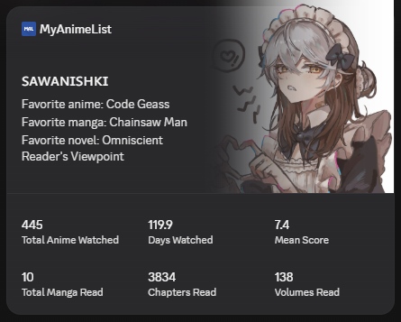

# MyAnimeList Discord Widget

This repository provides an unofficial, custom-built solution for displaying a **MyAnimeList** widget on your Discord profile (similar to the "Last.FM" widget).

Built using Python 3.14.6, this project contains everything you need to deploy your own custom widget. It communicates directly with the official MyAnimeList API, calculates statistics locally, and includes automatic OAuth token refresh handling.

---

## Preview Image

The widget displays six compact stats on a Discord profile:


> **Note:** You can easily change the widget's color and image to whatever you want.
---

## Features

- Uses the official MyAnimeList OAuth2 API
- Automatically refreshes expired access tokens
- Calculates statistics locally
- Updates your Discord Profile Widget automatically
- Works with Windows Task Scheduler
- Lightweight and easy to configure

Displayed statistics:

- Anime Completed
- Days Watched
- Mean Score
- Manga Completed
- Chapters Read
- Volumes Read
> **Note:** You can easily change which statistics are displayed by modifying the project.
---

## Installation

Clone the repository.

```bash
git clone https://github.com/sawanishki/MAL-Discord-Widget.git
cd MAL-Discord-Widget
```

Install the required packages.

```bash
pip install -r requirements.txt
```
> **Note:** Python 3.10 or newer is not required, but it's recommended to avoid problems.
---

## Discord Widget Setup

Create a Discord application using the Discord Developer Portal. 
Follow Chloe Cinders' guide for the Discord widget/application setup:
(https://chloecinders.com/blog/discord-widgets)

Create a **Profile Widget** and note down your:

- Application ID
- Bot Token
- User ID

Change `.env.template` file name to `.env` and replace the placeholder values.

Here's what it should look like:

```env
MAL_CLIENT_ID=your_mal_client_id
MAL_CLIENT_SECRET=your_mal_client_secret

BOT_TOKEN=your_discord_bot_token
APPLICATION_ID=your_application_id
USER_ID=your_discord_user_id
```

Change `tokens.template.json` file name to `tokens.json`.

Here's what it should look like:

```json
{
    "token_type": "Bearer",
    "access_token": "your_access_token",
    "refresh_token": "your_refresh_token",
    "expires_in": 2678400,
    "expires_at": 0
}
```
> **Note:** You will get the missing values later.

---

## MyAnimeList API Setup

Create an API application at:

https://myanimelist.net/apiconfig

Application Type:

```
Web
```

Redirect URI:

```
http://localhost:8000/callback
```

Note down your:

- Client ID
- Client Secret

---

## 1. Method: First-time Authorization

Authorize your MyAnimeList account:

```bash
python authorize.py
```

After authorizing, exchange the authorization code for OAuth tokens:

```bash
python oauth_setup.py
```

This creates your local authentication file (`tokens.json`).

Once configured, the application automatically refreshes your access token whenever it expires.

There's 2 methods for authorization and if this didn't work for you I recommend you using the next method.

---

## 2. Method: Authentication Using Postman (Recommended)

### Postman (Recommended)

If you have trouble exchanging the authorization code manually, you can use **Postman** to complete the OAuth flow.

### 1. Install Postman

Download and install Postman:

https://www.postman.com/downloads/

You can skip creating an account if prompted. It's also recommended that you don't create an account, since you'll only need Postman once.

---

### 2. Create a new request

- Click **New**
- Select **HTTP Request**
- Give it a name (for example, *MyAnimeList OAuth*)

---

### 3. Open the Authorization tab

At the top of the request, open the **Authorization** tab.

Configure it as follows:

| Setting | Value |
|---------|-------|
| Type | OAuth 2.0 |
| Grant Type | Authorization Code (With PKCE) |
| Callback URL | `http://localhost:8000/callback` |
| Auth URL | `https://myanimelist.net/v1/oauth2/authorize` |
| Access Token URL | `https://myanimelist.net/v1/oauth2/token` |
| Client ID | Your `MAL_CLIENT_ID` |
| Client Secret | Your `MAL_CLIENT_SECRET` |
| Scope | Leave blank |
| State | Any value (e.g. `discordwidget`) |
| Code Challenge Method | **Plain** |
| Client Authentication | **Send client credentials in body** |

> **Important:** Set **Code Challenge Method** to **Plain**, **not SHA-256**.

---

### 4. Request an access token

Click **Get New Access Token**.

A browser window will open.

- Log in to MyAnimeList.
- Click **Authorize**.

If everything is configured correctly, Postman will display your:

- Access Token
- Refresh Token
- Expires In

---

### 5. Update `tokens.json`

Copy the following values into `tokens.json`:

- `access_token`
- `refresh_token`
- `expires_in`

The project will automatically update `expires_at` after the first successful token refresh, so you won't need to edit it.

Once this is done, `update.py` will automatically refresh your access token whenever it expires.

---

## Automatic Updates With Windows Task Scheduler

Schedule `update.py` using Windows Task Scheduler.

Recommended configuration:

Program:

```
pythonw.exe
```

Arguments:

```
update.py
```

Start in:

```
C:\Path\To\MAL-Discord-Widget
```

Using **pythonw.exe** instead of python.exe prevents a Command Prompt window from appearing whenever the scheduled task runs.

---

## Project Structure

```
MAL-Discord-Widget/
│
├── authorize.py
├── oauth_setup.py
├── mal_api.py
├── calculate_stats.py
├── update.py
├── requirements.txt
├── duration_cache.json
├── .gitignore
├── README.md
│
├── .env.template --> .env
└── tokens.template.json --> tokens.json
```

---

## Resources

### Discord Widgets

- [Chloe Cinders' Blog Post](https://chloecinders.com/blog/discord-widgets)

- [No Text To Speech's YouTube video on Widgets](https://www.youtube.com/watch?v=gYv7D83u7yQ)

- [Discord Developer Portal](https://discord.com/developers/applications)

### Automatically Updating Your Statistics

- [Windows Task Scheduler Guide](https://community.esri.com/t5/python-documents/schedule-a-python-script-using-windows-task/ta-p/915861)

> **Tip:** Use **pythonw.exe** instead of **python.exe** if you don't want a Command Prompt window to appear whenever the scheduled task runs.

---

## Notes

This project intentionally **does not use third party API providers like Jikan**.

Although Jikan is an excellent unofficial API, it may occasionally experience cache delays or temporary outages.

Instead, this project communicates directly with the official MyAnimeList API and calculates all displayed statistics locally, ensuring they remain accurate and update immediately after changes are made to your MyAnimeList profile.

---

## Credits And Honorable Mentions

**Tutorials:** Huge thanks to **Chloe Cinders** for the incredible blog tutorial on custom Discord Widgets, and to **NTTS** for the fantastic video guide based on that post.

**Inspiration:** Originally inspired by the Last-FM Widget (by vivzio) and wakatime-widget (by Aemeath). These projects demonstrated how Discord Profile Widgets could be updated programmatically. This repository adapts that foundational logic for the official MyAnimeList API, utilizing a completely redesigned authentication flow and statistics pipeline.

---

## Disclaimer

This project is an independent, community-made application and is **not affiliated with, endorsed by, or sponsored by** MyAnimeList or Discord.

---
